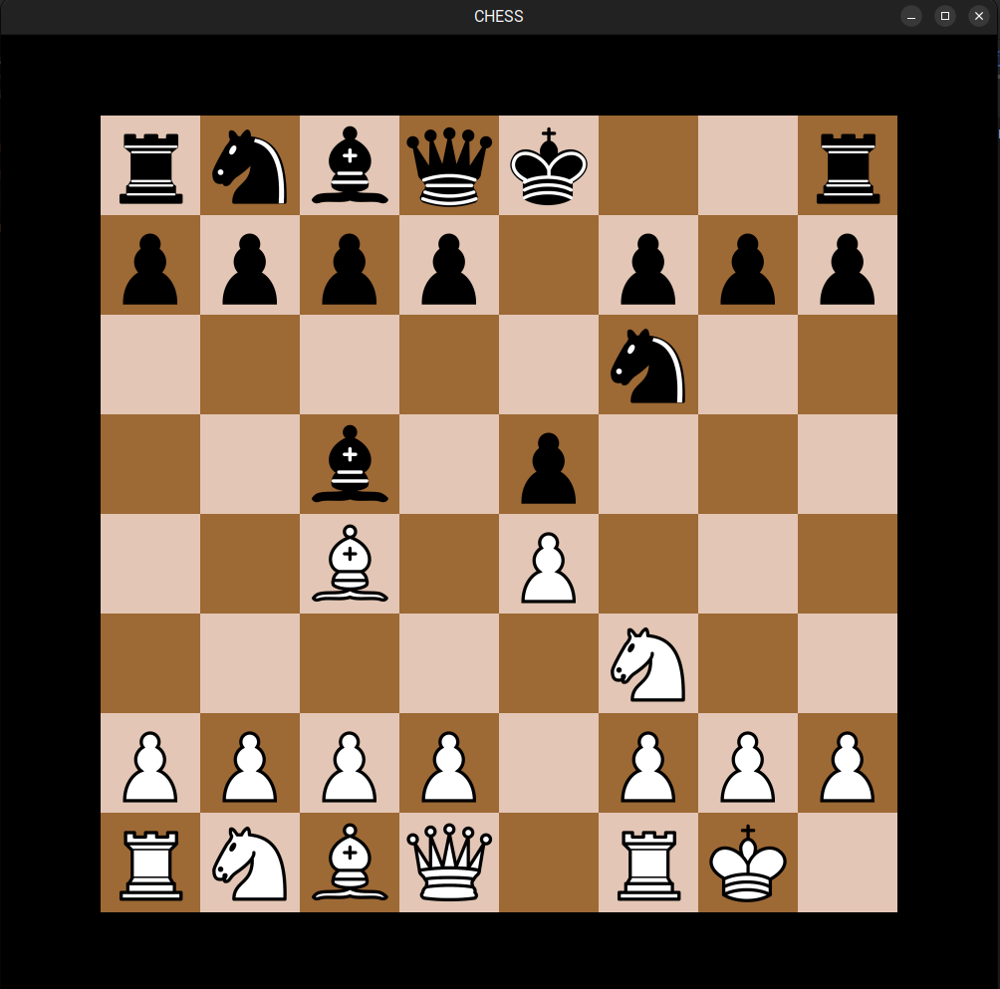

# Chess Game in Java

## Overview
This is a fully functional **Chess Game** implemented in **Java**, supporting all standard chess rules, including **castling, checkmate, and valid move highlighting**. It is a **two-player game** with an interactive GUI that allows players to see available moves upon selecting a piece.

## Features
- **Complete Chess Rules** – Supports all standard chess moves, including:
  - ✅ **Castling**
  - ✅ **Pawn Promotion**
  - ✅ **Check & Checkmate**

- **Move Highlighting** – Displays legal moves when a piece is selected.
- **Two-Player Mode** – Play locally against another person.
- **Turn-Based System** – Automatically switches turns between White and Black.

## How to Play
1. Select a chess piece by clicking on it.
2. Available legal moves will be highlighted.
3. Click on a highlighted square to move the piece.
4. Checkmate your opponent to win!

## Screenshots
| Initial Board | Move Highlighting | Castling |
|--------------|------------------|---------|
|  |  |  |

